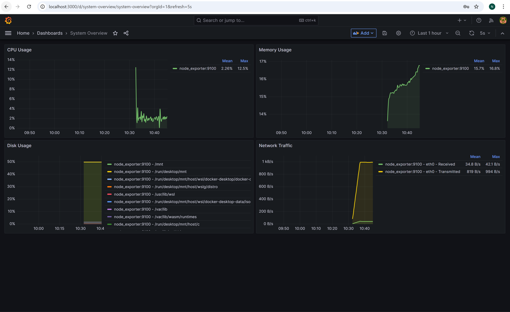
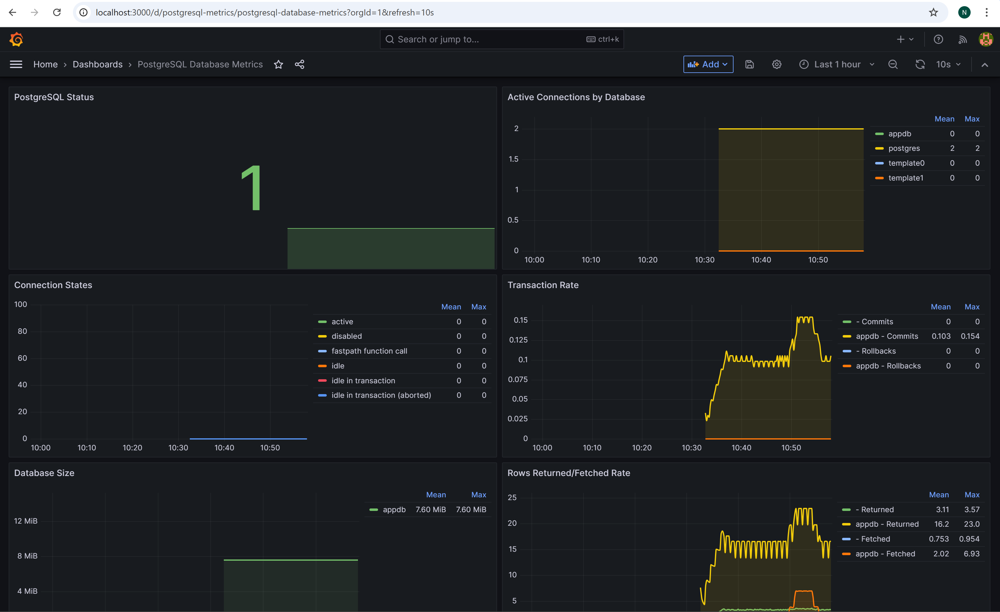
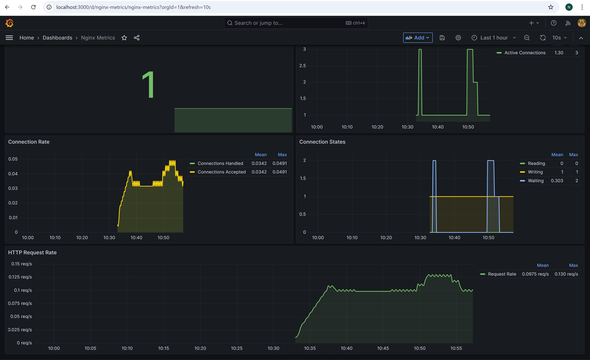

# Containerized Web Application with Monitoring

This repository contains a containerized web application infrastructure with comprehensive monitoring. The system consists of an Nginx web server, a Python Flask backend API, a PostgreSQL database, and a complete monitoring stack using Prometheus and Grafana.

## Architecture Overview

```
                                +----------------+
                                |                |
                                |     Nginx      |<------+
                                |  (Web Server)  |       |
                                |                |       |
                                +--------+-------+       |
                                         |               |
                                         v               |
                                +--------+-------+       |
                                |                |       |
                                |  Flask Backend |       |
                                |     (API)      |       |
                                |                |       |
                                +--------+-------+       |
                                         |               |
                                         v               |
                                +--------+-------+       |
                                |                |       |
                                |   PostgreSQL   |       |
                                |   (Database)   |       |
                                |                |       |
                                +----------------+       |
                                                         |
                 +-------------------------------------+ |
                 |                                     | |
+----------------v--------+   +----------------+   +---+--------------+
|                         |   |                |   |                  |
|      Prometheus         |<--+     Various    |   |     Grafana      |
|  (Metrics Collection)   |   |    Exporters   |   |  (Visualization) |
|                         |   |                |   |                  |
+-------------------------+   +----------------+   +------------------+
```

### Components

- **Nginx**: Acts as a reverse proxy and serves static content
- **Flask Backend**: Provides the REST API for the application, runs with Gunicorn for production
- **PostgreSQL**: Stores application data in optimized schema with users, items, and categories
- **Prometheus**: Collects and stores metrics with custom alerting rules
- **Exporters**: Collect metrics from various services
  - Node Exporter: Host metrics (CPU, memory, disk)
  - PostgreSQL Exporter: Database metrics (connections, queries)
  - Nginx Exporter: Web server metrics (requests, status codes)
- **Grafana**: Visualizes metrics and provides alerting dashboards

## Setup and Configuration

### Prerequisites

- Docker and Docker Compose installed
- Ports 80, 3000, 9090, 9100, 9113, and 9187 available on your host

### Installation

1. Clone this repository:
   ```
   git clone https://github.com/Nicoleta-Sandu/web-infrastructure
   cd web-infrastructure
   ```

2. Start the services:
   ```
   docker-compose up -d
   ```

3. Access the application and monitoring tools:
   - Web Application: http://localhost:80
   - Prometheus: http://localhost:9090
   - Grafana: http://localhost:3000 (default credentials: admin/secure_grafana_password)

## Usage

### API Endpoints

The backend API provides the following endpoints:

- `GET /api/items`: List all items
- `GET /api/items/{id}`: Get a specific item
- `POST /api/items`: Create a new item (requires name, price, user_id)
- `PUT /api/items/{id}`: Update an item
- `DELETE /api/items/{id}`: Delete an item
- `GET /api/health`: Health check endpoint
- `GET /api/metrics`: Prometheus metrics endpoint

Example requests:
```bash
# Get all items
curl -X GET http://localhost/api/items

# Get a specific item
curl -X GET http://localhost/api/items/1

# Create a new item
curl -X POST http://localhost/api/items \
  -H "Content-Type: application/json" \
  -d '{"name": "New Item", "description": "Description", "price": 29.99, "user_id": 1, "category_id": 2}'

# Update an item
curl -X PUT http://localhost/api/items/1 \
  -H "Content-Type: application/json" \
  -d '{"name": "Updated Item", "price": 39.99}'

# Delete an item
curl -X DELETE http://localhost/api/items/1
```

### Database Schema

The application uses a PostgreSQL database with the following schema:

- **users**: Store user information
  - `id`: Primary key
  - `username`: User's username (unique)
  - `email`: User's email (unique)
  - `created_at`: Timestamp

- **categories**: Store item categories
  - `id`: Primary key
  - `name`: Category name (unique)
  - `description`: Category description
  - `created_at`: Timestamp

- **items**: Store product items
  - `id`: Primary key
  - `name`: Item name
  - `description`: Item description
  - `price`: Item price
  - `user_id`: Foreign key to users
  - `category_id`: Foreign key to categories
  - `created_at`: Creation timestamp
  - `updated_at`: Last update timestamp

### Monitoring

#### Dashboards

The following dashboards are available in Grafana:

1. **System Overview**: CPU, memory, disk, and network metrics

2. **Database Metrics**: PostgreSQL metrics including connections, query performance

3. **Nginx Metrics**: Request rates, status codes, performance metrics


#### Alerts

Preconfigured alerts include:

- **System Alerts**:
  - High CPU usage (>80% for 5 minutes)
  - High memory usage (>80% for 5 minutes)
  - High disk usage (>80% for 5 minutes)

- **Application Alerts**:
  - API high error rate (>5% errors for 2 minutes)
  - API high latency (95th percentile >1s for 5 minutes)

- **Database Alerts**:
  - PostgreSQL down
  - PostgreSQL high connections (>80% of max for 5 minutes)

## Maintenance Procedures

### Backup and Restore

#### Database Backup

```bash
docker exec web_postgres pg_dump -U postgres appdb > backup.sql
```

#### Database Restore

```bash
cat backup.sql | docker exec -i web_postgres psql -U postgres appdb
```

### Updating Services

1. Pull the latest code:
   ```bash
   git pull
   ```

2. Rebuild and restart containers:
   ```bash
   docker-compose up -d --build
   ```

### Logs

Access logs for each service:

```bash
# Nginx logs are available in the ./logs/nginx directory
cat logs/nginx/access.log
cat logs/nginx/error.log
cat logs/nginx/app_access.log
cat logs/nginx/app_error.log

# View container logs
docker-compose logs -f
docker-compose logs -f backend
docker-compose logs -f postgres
```

## Troubleshooting

### Common Issues

#### Services Not Starting

Check the status and logs:
```bash
docker-compose ps
docker-compose logs <service-name>
```

#### Database Connection Issues

Verify the database is healthy:
```bash
docker exec web_postgres pg_isready -U postgres
```

Check the backend logs for connection errors:
```bash
docker-compose logs backend
```

#### High Resource Usage

Check the System Overview dashboard in Grafana for resource bottlenecks.

Review container resource limits in docker-compose.yaml and adjust as needed.

### Health Checks

Each service has built-in health checks. Check their status:

```bash
docker inspect --format='{{.State.Health.Status}}' web_nginx
docker inspect --format='{{.State.Health.Status}}' web_backend
docker inspect --format='{{.State.Health.Status}}' web_postgres
docker inspect --format='{{.State.Health.Status}}' web_prometheus
docker inspect --format='{{.State.Health.Status}}' web_grafana
```

## Security Considerations

- All containers run as non-root users with least privileges
- Read-only filesystems with temporary directories for required write access
- Resource limits defined for all containers
- Security headers configured in Nginx
- Database access is restricted by network segmentation and user permissions
- PostgreSQL configured with secure settings
- HTTPS can be enabled by modifying the Nginx configuration

## Technical Details

### Container Configuration

- **Nginx**: Alpine-based with custom configuration for proxying API requests
- **Backend**: Python 3.11 with Flask and Gunicorn, runs with 4 workers
- **PostgreSQL**: Version 15 with custom configuration for performance
- **Prometheus**: Configured with alerting rules and metric collection
- **Grafana**: Pre-configured dashboards for visualization

### Networks

Three isolated Docker networks are used:
- `frontend`: Connects Nginx and the Backend
- `backend`: Connects Backend and PostgreSQL
- `monitoring`: Connects all monitoring components
